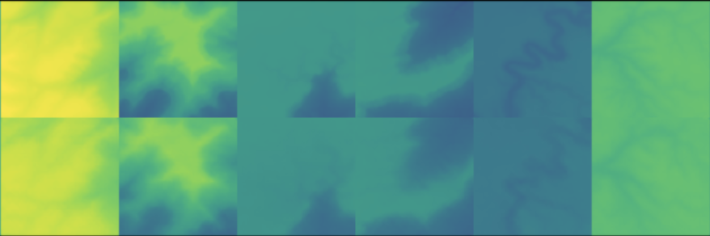

# Procedural and Expandable Neural Terrain Generation with Transformers
## A Pytorch implementation of a MaskGIT-based pipeline to generate infinitely expandable procedural terrain based on real-world geographical data

Existing approaches to procedural generation of terrain fail to account for the diversity of geology and topography evident in the real world, or fail to do it scalably. 
- Noise-based approaches have no physical basis and require careful tuning of parameters to produce convincing results. Furthermore, they suffer from artifacting and repetitiveness.
- Erosion-based approaches produce great quality for one region of terrain, but the produced terrain cannot be expanded easily and the process usually cannot be done online.
- GANs also do not scale well with increased map size. Also, they have no sense of long-range relations, which are important in real terrain (ie. rivers ending in the sea or mountains sloping off into plains).

By leveraging a transformer trained on the abstract space of a VQGAN, this model aims to produce topologically and geologically coherent height maps with meaningful long-range relations and infinite extensibility. 

Objectives:
1) Implement MaskGIT and generate height maps based on real world elevation data.
2) Integrate climatological data and geological data to provide coherent climate and rock types which can inform later steps of generation (vegetation, surface material, weather) and produce meaningful environments
3) (Optional) Replace MaskGIT scheduler to allow for explicit control over the order in which tokens are generated

## Objective 1:

## Stage 1 [Completed]
### VQVAE

Validated performance of VQVAE implementation on STL10 to establish a performance baseline.

#### STL10 (50 epochs, Latent resolution 8x8x256, codebook size 1024).


#### Notes:
- Codebook utilization is quite poor. This can be addressed with codebook resampling, codebook diversity loss, or better initialization (https://arxiv.org/html/2406.11837v1#S4).
- Using the same number of downsamples as the VQVAE paper with a reduced resolution is unfeasible because it produces a latent space of only 4 x 4, and the information loss is too severe.

## Stage 2 [Completed]
### Discriminator and Adversarial Stabilization

Identified and addressed instabilities in adversarial training. Produced qualitatively superior reconstructions when compared to VQVAE.

#### STL10 (50 epochs):

Note the superior color reproduction on the birds and sharper detail in the sky when compared to the VAE. While the boat and the far right image show better sharpness, they also have some clear artifacting.

#### USGS DEM (100 epochs, tiff converted to png for memory conservation):

The reconstructions successfully captures the general contours of the terrain, but struggle somewhat still with high frequency information and oversmoothing of some gradients.

#### Notes:
- The VQGAN is trained without the discriminator loss applied to the VAE for some initial period. Once the loss starts to be incorporated into the VAE loss function, however, the discriminator's outputs converge quickly and provides no useful feedback for the generator. The VQGAN's adaptive loss scaling increases the weight of the discriminator loss relative to the combined perceptual and reconstruction loss when the gradient in the discriminator is weak. This scaling amplifies the noise outputted by the non-functioning discriminator. As such, the loss function is dominated by the spurious discriminator signal to the detriment of the reconstruction quality. To improve the quality of the signal from the discriminator, a scaling factor inversely proportional to the discriminator loss is applied to the generator loss. Thus, when the discriminator loss is very high, the generator largely trains only on the perceptual / reconstruction loss. As the discriminator gains power, the loss from the discriminator contributes more to the generator loss function. Thus, the generator and discriminator are balanced without extensive manual tuning, with neither dying out due to the other performing too well.
- Hinge loss was found to be more stable than MSE loss for the discriminator.
- The shortcut implementation of non-saturating loss in the generator can produce negative numbers, which can cause the generator to deemphasize the reconstruction / perceptual loss (which cannot give negative numbers). Replacing with the full implementation improved balance between the components of the loss function.
- Current discriminator is not patch-based. Implementing a patch-based discriminator may improve local sharpness and texture.

## Stage 3 [WIP]
### Transformer and Mask Scheduler

Implementation of the BERT-based bidirectional transformer and MaskGIT scheduler is underway.

## Objective 2:

Fuse climatological data into height map for cross-modal conditioned generation. Mid fusion in the latent space with dual encoders allows the transformer to consider the relation between the climate and terrain tokens simultaneously without forcing the encoder to learn both, semantically distinct, modalities.

Investigate three fusion strategies:
- Low-fusion with simple stacking of data layers as baseline.
- Simple concatenation of terrain and climate tokens at the vector quantization level.
- First generate terrain, then condition climate generation with existing terrain with cross attention.

## Objective 3:

The MaskGIT scheduler simultaneously predicts all tokens, discards the least confident, and repeats. If the terrain generation is performed only once, this is fine, but in order to continually outpaint the terrain while appropriately considering the already existing terrain, it would be preferable to control which tokens are generated to reduce sequence length and computational overhead.

The scheduler will only generate masked tokens contiguous with existing terrain. Thus, we can maximize context while minimizing sequence length, while still retaining the option to expand the terrain more at a later iteration.

## Further extensions:

Limitations in processing power makes high-resolution synthesis with transformers alone impractical on consumer hardware. Diffusion-based super resolution could allow for post hoc augmentation of generated height map resolution without costly erosion simulation or high-resolution patches.

## Usage:

1) Make virtual environment with Python >= 3.12. Install requirements.txt.
2) Download STM10 datset or DEM tiff from links below. If using tiff data, use ```_notebooks/slice_geo_data.ipynb``` to process the tiff into smaller png patches and sample a training dataset.
3) Train with ```python3 train_vqgan.py --config {config name}```, where config name is the name of a config file in ./configs. Training using the flag ```--checkpoint ```, which will use the latest checkpoint unless otherwise specified. Output directory can be specified with ```--save_as name```.
4) Visualize reconstruction quality with ```python3 evaluate.py --checkpoint_dir directory --checkpoint checkpoint.pt```
5) Losses and other performance metrics are logged automatically and can be visualized with ```_notebooks/training_stats.ipynb```

## Datasets:

- https://cs.stanford.edu/~acoates/stl10/
- https://data.usgs.gov/datacatalog/data/USGS:77ae0551-c61e-4979-aedd-d797abdcde0e
- https://www.cec.org/files/atlas/?z=4&x=-93.3838&y=43.1651&lang=en&layers=climatezones&opacities=100&labels=true

# References:

[1]
H. Chang, H. Zhang, L. Jiang, C. Liu, and W. T. Freeman, ‘MaskGIT: Masked Generative Image Transformer’, arXiv [cs.CV]. 2022.

[2]
P. Esser, R. Rombach, and B. Ommer, ‘Taming Transformers for High-Resolution Image Synthesis’, arXiv [cs.CV]. 2021.

[3]
A. van den Oord, O. Vinyals, and K. Kavukcuoglu, ‘Neural Discrete Representation Learning’, arXiv [cs.LG]. 2018.

## Hardware:

All training and evaluation performed on an NVIDIA RTX 5070ti with 16gb of VRAM.